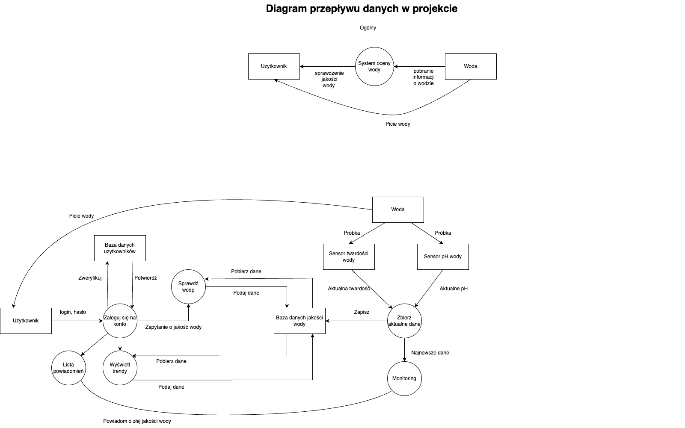

# PIJ ZDROWO
Projekt związany z przedmiotem *Bezpieczeństwo IoT* na kierunku *Cyberbezpieczństwo* na AGH.

## Cel projektu
Ułatwienie zwykłym ludziom pomiaru czystości oraz zużycia wody w danym obiegu

## Opis projektu
Koncept projektu zakłada stworzenie urządzenia, które umożliwi poprzez aplikację webową bądź mobilna (or both) weryfikowanie stanu czystości spożywanej przez nas wody w rurach wodociągowych, monitorować wszelkiej maści uszkodzenia rur, zły stan linii wodociągowych, oraz zużycie jej w celu np. prognozowania zapotrzebowania, wysokości opłat. Założeniem jest podawanie tych danych w miarę możliwości sprzętowych w czasie rzeczywistym, gdyż dostępne badania hydrologiczne są badaniami statycznymi udostępnianymi co jakiś czas przez urzędy tym się zajmujące.

## Klient projektu
Urządzenie będzie mogło być dostosowane do pomiarów dla gospodarstw domowych.
Ewentulanie w dalszej kolejności do spółek zarządzających nieruchomościami, urzędów i korporacji. 

## Dlaczego warto sprawdzać czystość wody?
Wychodzimy naprzeciw pojawiającym się pytaniom przewijającym się na różnych forach, odnośnie tego czy woda w danym miejscu jest czysta, zdatna do picia, czy można pić ją bezpośrednio z kranu czy lepiej ją przefiltrować. Ankiety wykazały że jedna na 4 osoby pije wodę bezpośrednio ze swojej domowej instalacji wodociągowej (czyli kranu), bez dodatkowego filtrowania i weryfikowania jej zdatności do picia. Aż 85% tych samych ankietowanych odpowiedziało jednak, że interesuje ich zdatność do picia i jakość wody którą spożywają, natomiast ponad 90% stwierdziło, że skorzystało by z narzędzia które określałoby jakość wody w ich kranach. Oprócz przesłanek społecznych w celu stworzenia takiego urządzenia, zauważyliśmy problem obecnie dostępnych publicznie badań hydrologicznych, a mianowicie ich statyczność i bardzo duża ogólność. Na czystość wody może bowiem wpływać stan instalacji wodociągowej w budynku w którym tej wody użytkujemy, a takich informacji nie jesteśmy w stanie otrzymać, jeśli nie zlecimy sami szczegółowych badań hydrologicznych. 
Nasze urządzenie miałoby w założeniu ten problem rozwiązywać.

### Diagram projektu

